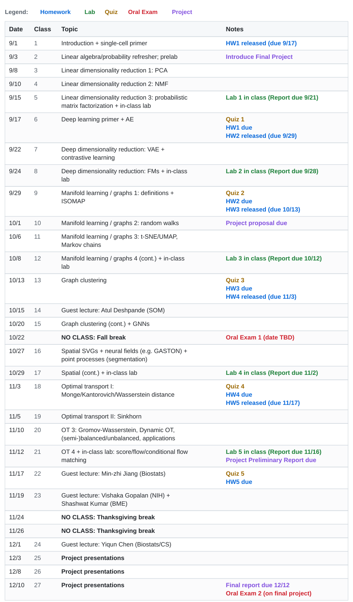

# ML for Single-Cell and Spatial Genomics (Fall 2026)

**Instructor:** Uthsav Chitra ([uthsav@jhu.edu](mailto:uthsav@jhu.edu))  
**TA:** Sayuni (Sai) Dharmasena ([sdharma5@jhu.edu](mailto:sdharma5@jhu.edu))  
**Class Hours:** TTh 4:30 PM – 5:45 PM | Homewood Campus, Gilman 55  
**Office Hours:** TBD  
**Discussion Board:** TBD  
**Gradescope:** TBD

---

## Course Overview

Recent experimental advances enable the measurement of DNA, RNA and other diverse molecular modalities inside individual cells at an unprecedented scale and resolution. Computational and machine learning (ML) methods are essential for analyzing and interpreting these high-dimensional, single-cell genomics datasets. This course introduces computational/ML frameworks that are often used to analyze modern single-cell and spatial datasets. Topics include but are not limited to: matrix factorization; autoencoders and contrastive learning; graphs and manifold learning; graph neural networks; computational optimal transport (OT); Gromov-Wasserstein and dynamic OT. Expected course background in python programming, probability, linear algebra, and multi-variable calculus. A machine learning/data science course is strongly recommended. No biology background is necessary.

## Course Resources

| Resource | Link |
|---|---|
| Syllabus & Policies | [syllabus.pdf](syllabus.pdf) |
| Assignments | [assignments/](assignments/README.md) |
| Labs | [labs/](labs/) |
| Lectures | [lectures/](lectures/) |

---

## Schedule

Accessible plain-text schedule

| Date | Class Notes | Topic | Notes |
|------|-------|-------|-------|
| 9/1 | [1](lectures/) | Introduction + single-cell primer | HW1 released <mark>(due **9/17**)</mark> |
| 9/3 | [2](lectures/) | Linear algebra/probability refresher; prelab | Introduce Final Project |
| 9/8 | [3](lectures/) | Linear dimensionality reduction 1: PCA | |
| 9/10 | [4](lectures/) | Linear dimensionality reduction 2: NMF | |
| 9/15 | [5](lectures/) | Linear dimensionality reduction 3: probabilistic matrix factorization + in-class lab | Lab 1 in class (Report <mark>due **9/21**</mark>) |
| 9/17 | [6](lectures/) | Deep learning primer + AE | **Quiz 1** HW1 <mark>due</mark> HW2 released <mark>(due **9/29**)</mark> |
| 9/22 | [7](lectures/) | Deep dimensionality reduction: VAE + contrastive learning | |
| 9/24 | [8](lectures/) | Deep dimensionality reduction: FMs + in-class lab | Lab 2 in class (Report <mark>due **9/28**</mark>) |
| 9/29 | [9](lectures/) | Manifold learning / graphs 1: definitions + ISOMAP | **Quiz 2** HW2 <mark>due</mark> HW3 released <mark>(due **10/13**)</mark> |
| 10/1 | [10](lectures/) | Manifold learning / graphs 2: random walks | Project proposal <mark>due</mark> |
| 10/6 | [11](lectures/) | Manifold learning / graphs 3: t-SNE/UMAP, Markov chains | |
| 10/8 | [12](lectures/) | Manifold learning / graphs 4 (cont.) + in-class lab | Lab 3 in class (Report <mark>due **10/12**</mark>) |
| 10/13 | [13](lectures/) | Graph clustering | **Quiz 3** HW3 <mark>due</mark> HW4 released <mark>(due **11/3**)</mark> |
| 10/15 | [14](lectures/) | Guest lecture: Atul Deshpande (SOM) | |
| 10/20 | [15](lectures/) | Graph clustering (cont.) + GNNs | |
| 10/22 | | **NO CLASS: Fall break** | **Oral Exam 1** (date TBD) |
| 10/27 | [16](lectures/) | Spatial SVGs + neural fields (e.g. GASTON) + point processes (segmentation) | |
| 10/29 | [17](lectures/) | Spatial (cont.) + in-class lab | Lab 4 in class (Report <mark>due **11/2**</mark>) |
| 11/3 | [18](lectures/) | Optimal transport I: Monge/Kantorovich/Wasserstein distance | **Quiz 4** HW4 <mark>due</mark> HW5 released <mark>(due **11/17**)</mark> |
| 11/5 | [19](lectures/) | Optimal transport II: Sinkhorn | |
| 11/10 | [20](lectures/) | OT 3: Gromov-Wasserstein, Dynamic OT, (semi-)balanced/unbalanced, applications | |
| 11/12 | [21](lectures/) | OT 4 + in-class lab: score/flow/conditional flow matching | Lab 5 in class (Report <mark>due **11/16**</mark>) Project Preliminary Report <mark>due</mark> |
| 11/17 | [22](lectures/) | Guest lecture: Min-zhi Jiang (Biostats) | **Quiz 5** HW5 <mark>due</mark> |
| 11/19 | [23](lectures/) | Guest lecture: Vishaka Gopalan (NIH) + Shashwat Kumar (BME) | |
| 11/24 | | **NO CLASS: Thanksgiving break** | |
| 11/26 | | **NO CLASS: Thanksgiving break** | |
| 12/1 | [24](lectures/) | Guest lecture: Yiqun Chen (Biostats/CS) | |
| 12/3 | [25](lectures/) | **Project presentations** | |
| 12/8 | [26](lectures/) | **Project presentations** | |
| 12/10 | [27](lectures/) | **Project presentations** | Final report <mark>due **12/12**</mark> **Oral Exam 2** (on final project) |

---

## Grading

| Component | Weight |
|-----------|--------|
| In-class assessments | 25% (5% each) |
| Oral exam | 25% |
| Homework | 10% |
| Labs | 10% |
| Attendance and participation | 5% |
| Final project + oral exam | 25% |
